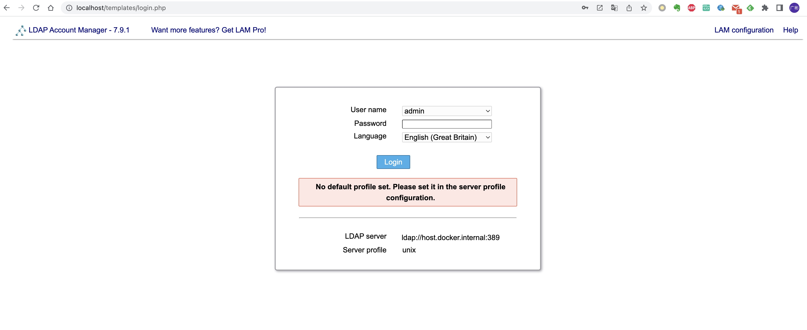
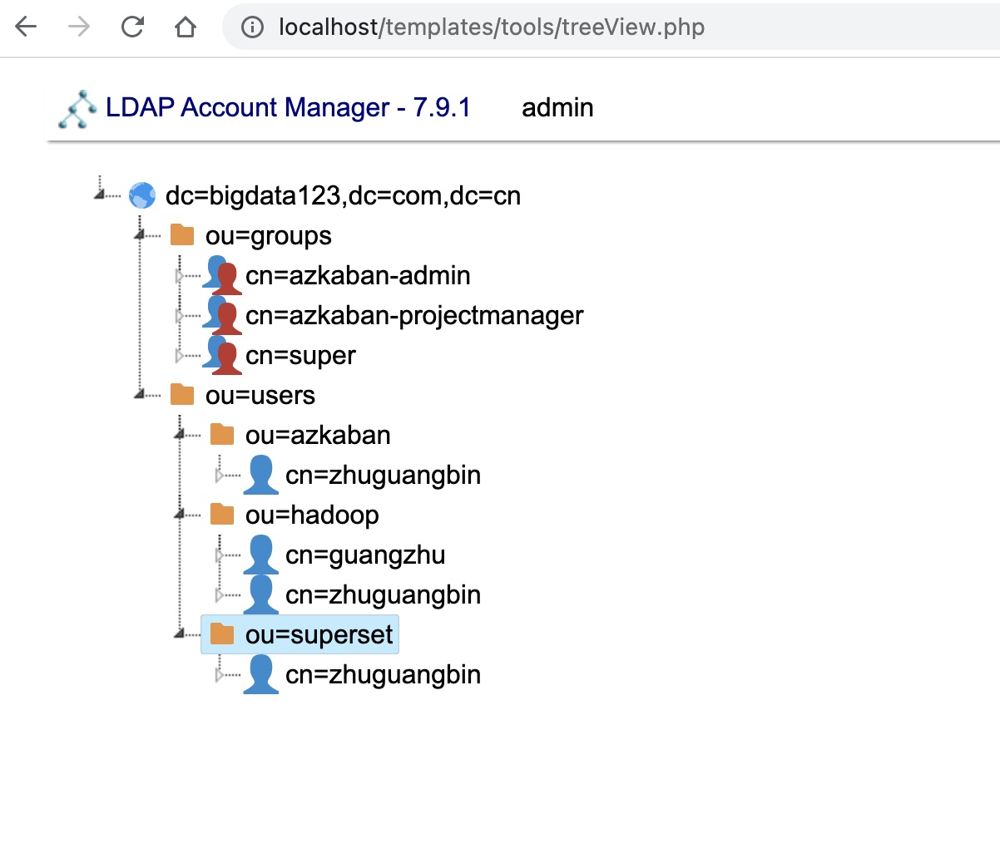

## OpenLdap Server on Docker

This guide helps you build an openldap server based on docker with a easy-to-use Web Admin Console: [Ldap Account Manager](https://www.ldap-account-manager.org/).

1. launch openldap server

```
mkdir -p /data/slapd
docker run \
        -p 389:389 -p 636:636 \
        --volume /data/slapd/database:/var/lib/ldap \
        --volume /data/slapd/config:/etc/ldap/slapd.d \
        --env LDAP_ORGANISATION="BigData Corp" \
        --env LDAP_DOMAIN="bigdata123.com.cn" \
        --env LDAP_ADMIN_PASSWORD="JonSn0w" \
        --env LDAP_TLS=false \
        --name ldapserver \
        --detach osixia/openldap:1.5.0 \
        --loglevel debug
```

2. download and install Ldap Account Manager (LAM)

```
wget -P /data/ https://jaist.dl.sourceforge.net/project/lam/LAM/7.9.1/ldap-account-manager-7.9.1.tar.bz2
cd /data
tar zxvf ldap-account-manager-7.9.1.tar.bz2

cd /data/ldap-account-manager-7.9.1
cd config
cp unix.sample.conf unix.conf
vim unix.conf
```

A complete available [unix.conf](conf/unix.conf) for you .

3. build a nginx docker image with php and ldap support as a web server for LAM

```
FROM trafex/php-nginx:latest

USER root
RUN apk add ldb-dev libldap openldap-dev 
RUN apk add php8-ldap php8-gettext php8-xmlwriter php8-gmp php8-zip
COPY php.ini /etc/php8/php.ini
USER nobody
```

```
docker build . -t php-ldap-nginx:v1
```

These build scripts are put under [docker-php-ladp-nginx](docker-php-ldap-nginx/).

4. launch LAM

```
docker run -d --name lam -p 80:8080 -v /data/ldap-account-manager-7.9.1:/var/www/html php-ldap-nginx:v1
```

visit `http://localhost` in you browser, you'll see LAM login page.



5. init ldap schema and manage you users and groups

[LAM official manual](https://www.ldap-account-manager.org/static/doc/manual-onePage/index.html) as a reference.

That's all. 

Ldap is an universal and centralized account management solution. We use it as production unix account and application level authentications. 

In BigData area, hadoop/azkaban/superset/ etc are integrated with ldap auth natively. we bring it in as our One-Account service. 

